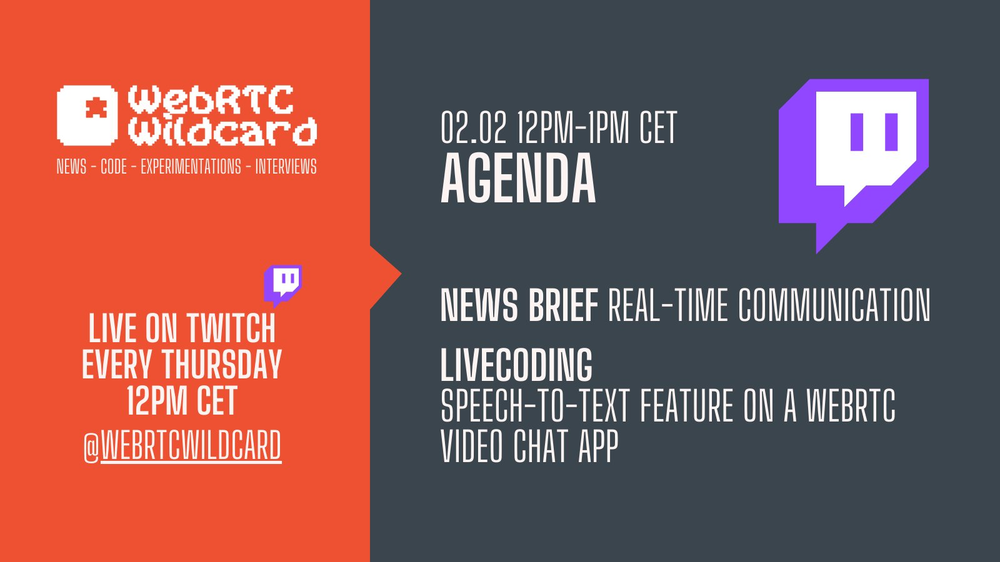

---
# Romain Vailleux

## DevRel at ApiRTC

### @rvailleux

### Episode #2

---

---

# Back from FOSDEM '23

## Dan Jenkins
## Janus
## Architecturing Jitsi for 10 000 participants
 
---

## Find these resources on

https://apirtc.com/blog/webrtc-wildcard-episodes/

___

# Livecoding
## Get an instant in-browser speech-to-text on camera stream

- [ ] Get a video app boilerplate (git clone https://github.com/ApiRTC/webrtc-wildcard-livecoding)
- [ ] Understand Vosk-browser  lib -> https://github.com/ccoreilly/vosk-browser
- [ ] Get a live transcription of what I say