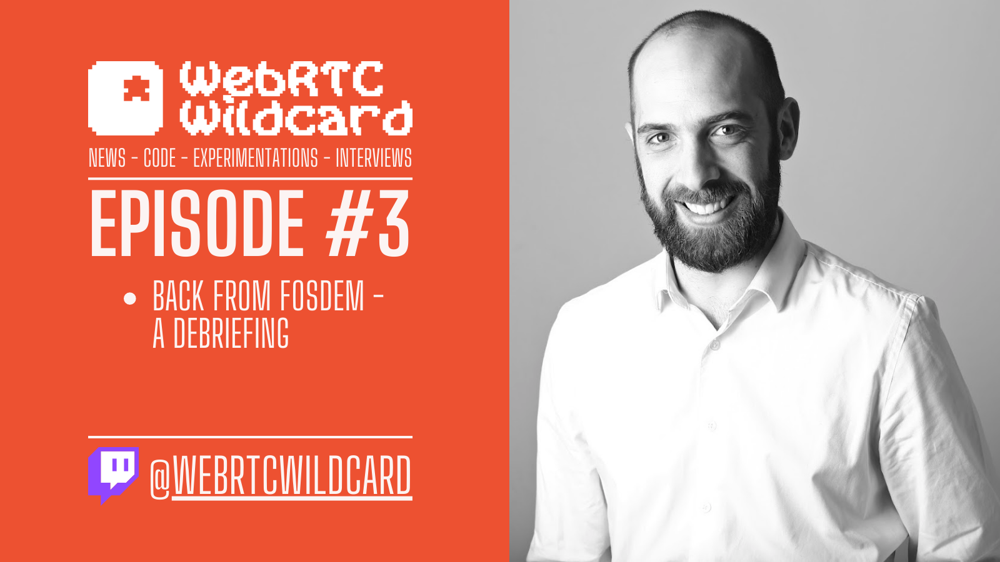

---
# Romain Vailleux

## DevRel at ApiRTC

### @rvailleux

### Episode #3

---

# Debriefing FOSDEM 2023 - It was grand! :rocket:
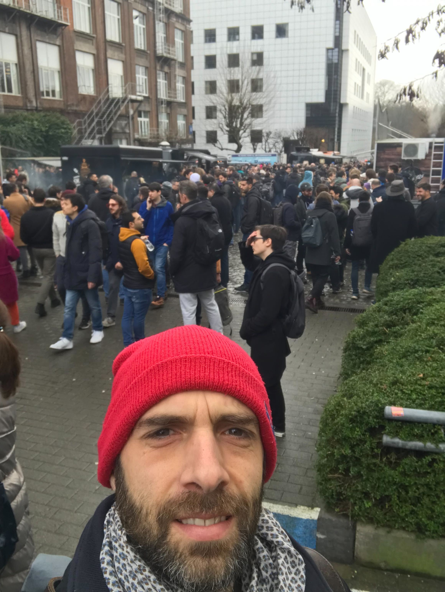 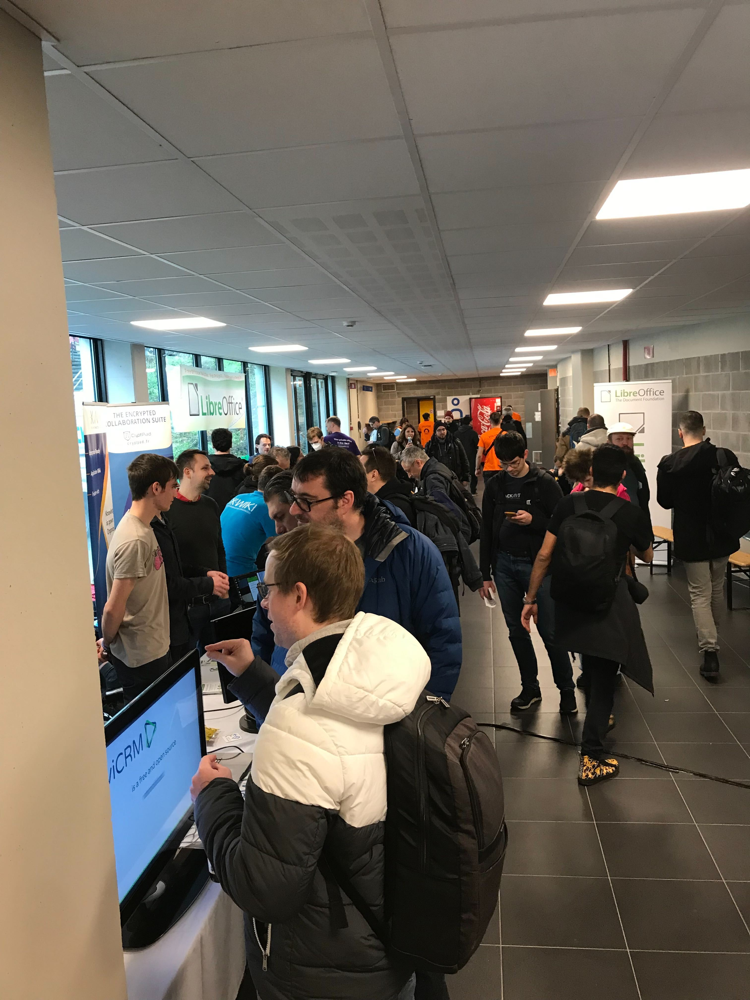 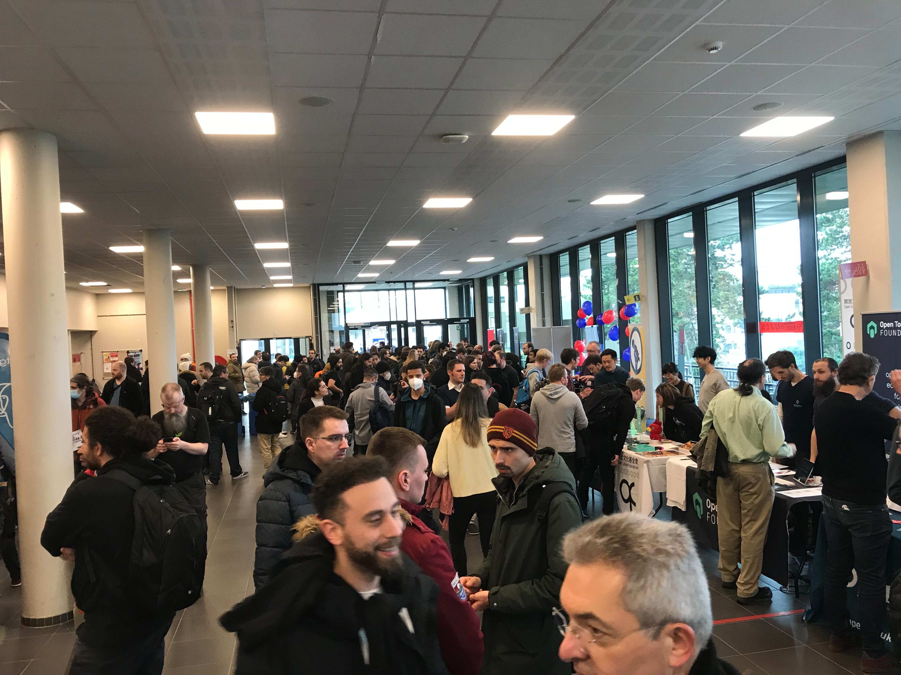

---

---

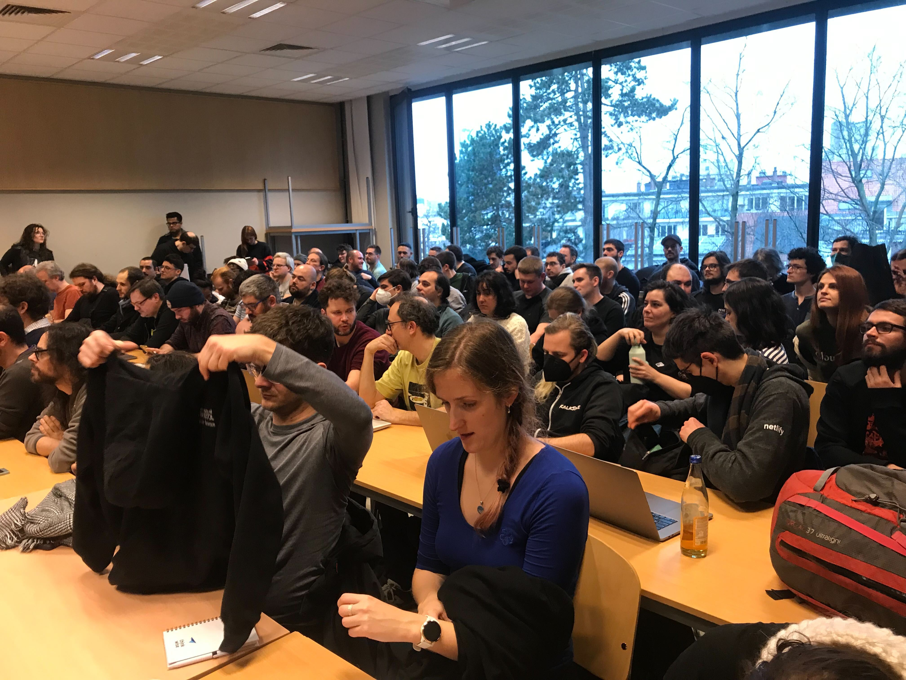

---
<!--
color: #ED5131
-->
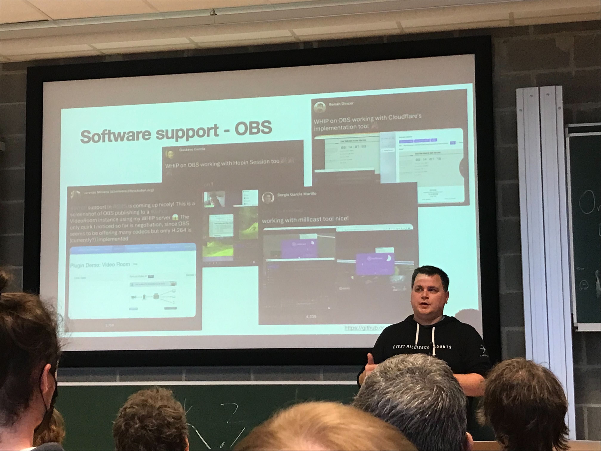
# Dan Jenkins on WHIP/WHEP/WHOAP

---

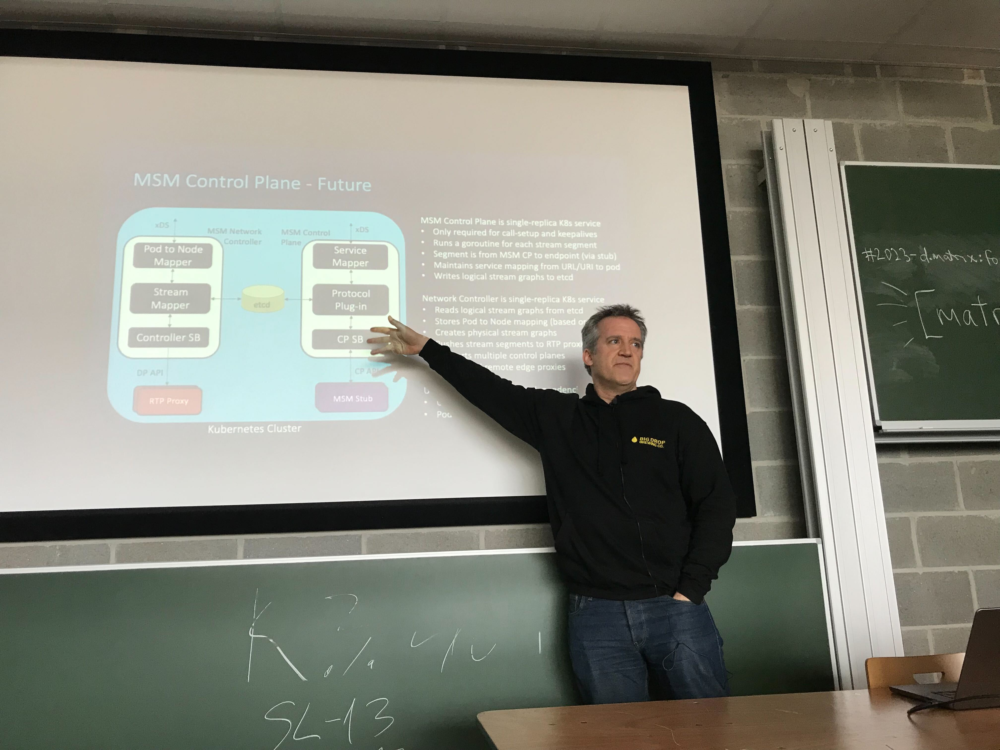
# Giles Heron on sustaining a realtime mesh architecture on Kubernetes

---

<!--
Prosody Snikket, Modern WMPP
-->

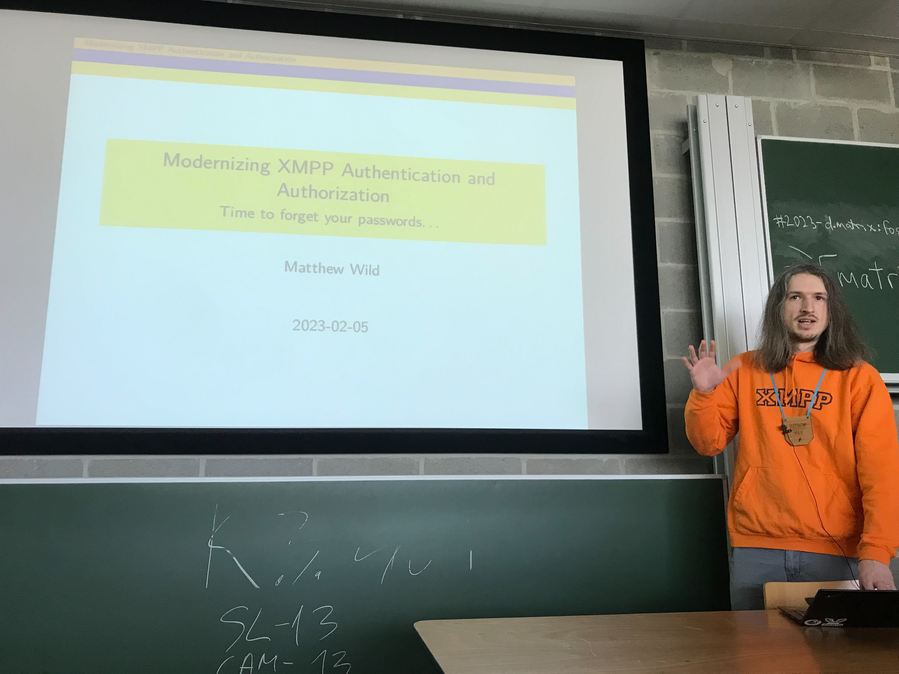
# Matthew Wild on Authentication
---

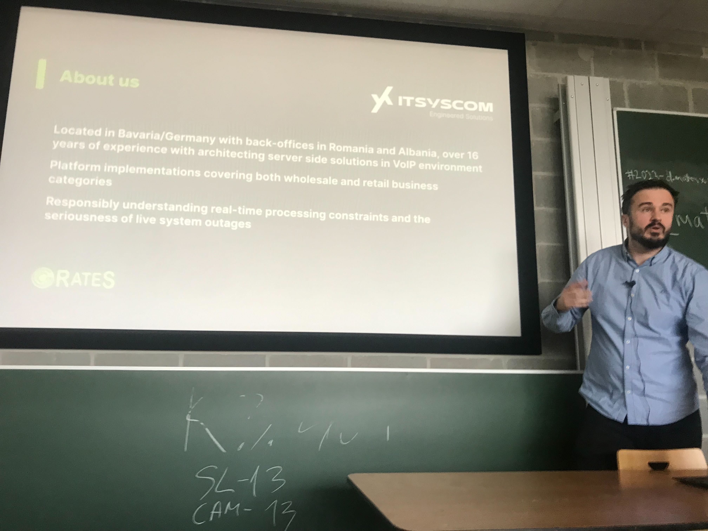
# Dan Christian Bogos on CGRateS

---
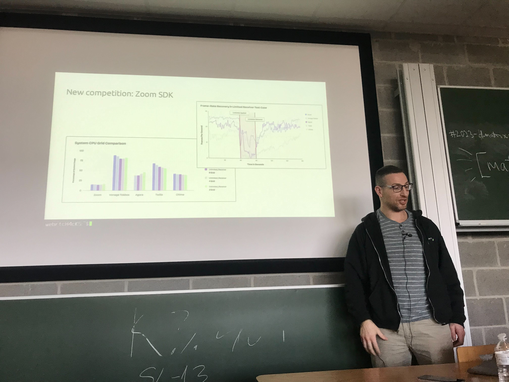
# Chad Hart sharing insight on how WebRTC in going in the developers' world

---
# Jehan Monnier on how they experiement WebRTC in Linphone
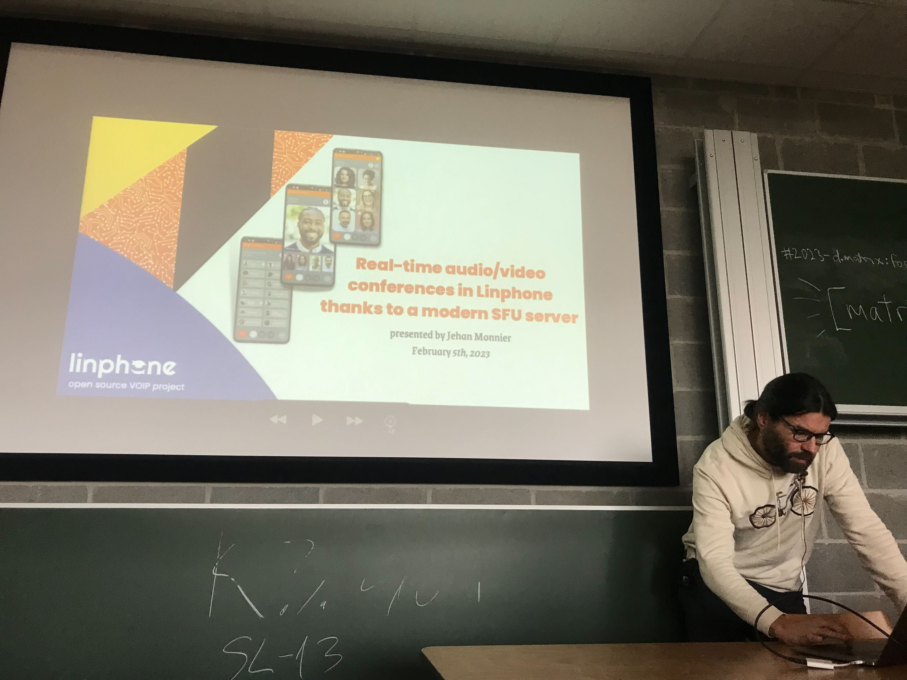

---

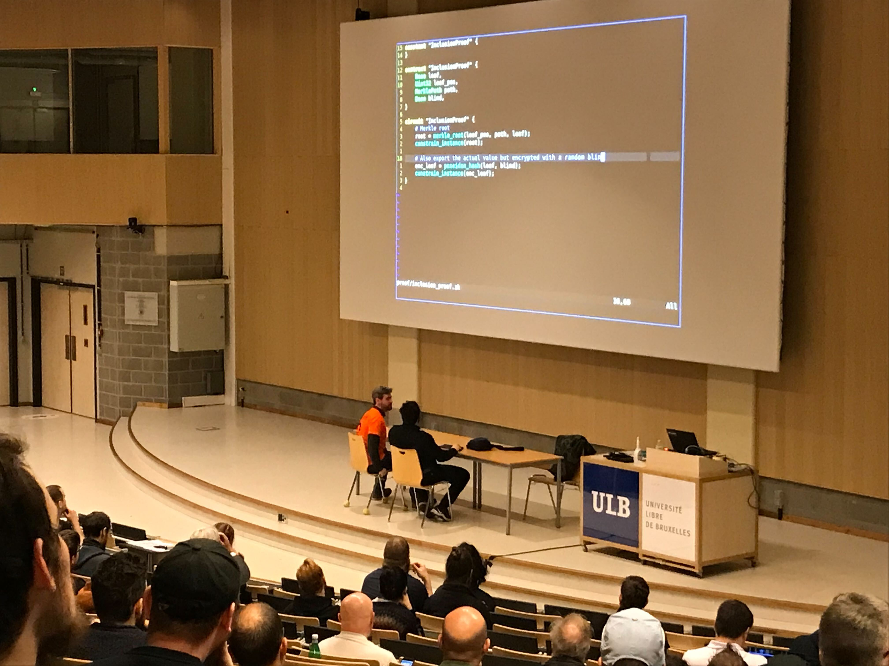
# Amir Taaki performing code on stage 🤩

---

## Find my full debrief on this article

https://www.linkedin.com/pulse/fosdem-2023-my-first-time-im-stunned-romain-vailleux/

---

# That's all folks!

See you next Thursday, 12pm CET. 👋

---
